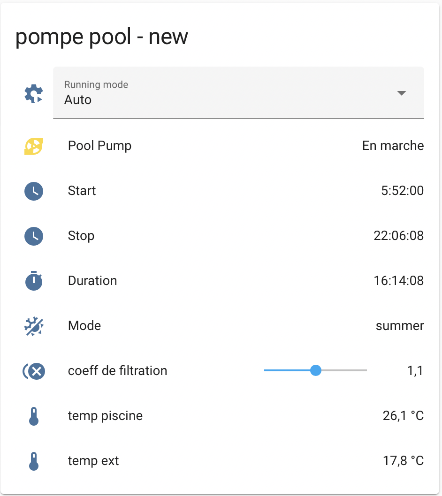

# shelly-pool-pump
Automatic schedule of your pool pump with temperature and freeze mode

This script is intended to  manage your pool pump from a Shelly Plus device.
He is compatible from firmware 1.0.8

The goal of this script is to make independant pool filtration system with just monitor and action with your home automation system.
If there is an issue ( your HA, network, .. ) Shelly device must continu to manage your filtration to have clear water :-)
 
Based on shelly script of ggilles with lot of new feature and improvment.
https://www.shelly-support.eu/forum/index.php?thread/14810-script-randomly-killed-on-shelly-plus-1pm/

Calculate duration filter from current temperature of water, and use max temp of the day and yesterday. The script use sun noon
to calculate the start of script and the end. the morning and the afternoon are separate by sun noon, and duration are equal.
manage freeze mode : under 0.5°C pump will be activate to prevent freeze of water.

Publish informations on MQTT for Home Assistant autodiscover, all sensors and switch are autocreate in your home assitant.
Before use the script you must configure correcly your Shelly device to connect a your MQTT broker trought web interface or shelly app.

Now, there is shelly addon sensor for your shelly plus. You mus use this to connect Two DS18b20 sensor

This script use also home hassitant to fetch sun noon and manage your filtration.

You have au slider to configure the factor of duration filtration, if you want adapt this, by default its 1, put you can choose what you want.

## Features:
* use sun noon to balance duration filtration
* Home Assistant MQTT Autodiscover sensors and switchs
    * start
    * stop
    * duration
    * pool temp
    * external temp
    * yesterday pool temp
    * max pool temp ( between today and yesterday)
    * display mode : freeze or summer
    * set coefficient of duration
    * status of pump
    * select mode : Auto, Force off,  Force on
* auto apply Freeze mode if water is under 0.5°C.
* customize duration with coefficient of duration
* choose manually to select Force On or off filtration or choose to use the "IA" :-) of script to manage your pump with Auto mode.

## Script configuration

*CONFIG.freeze_temp : prevent freeze of water under this temp
* CONFIG.shelly_id_temp_ext: Shelly id of external temp ( see your config on shelly UI
* CONFIG.shelly_id_temp_pool: Shelly id of water pool temp ( see your config on shelly UI
* CONFIG.ha_ip: IP of your Home assitant
* CONFIG.ha_token: long lived access token on your Home assistant API ( see here: https://developers.home-assistant.io/docs/auth_api/#:~:text=Long%2Dlived%20access%20tokens%20can,access%20token%20for%20current%20user. )

## Configuration of HA:
* you must have sun integration in your ha to provide sun.next_noon
* configure long live token to use in the script
* No automation need

## Connect shelly to your filtration pump system

The shelly hardware (for me shelly 1 plus) must replace your hardware clock in your electic panel.
**But, be careful, _you don't use_ your shelly schema like for a light.**
There are pic of current at start of the pump so your shelly can have some problem (reboot) and/or fire if you do that.

In theory your old hardware clock is connected to a relay. your shelly must make order to the relay to turn on/off the pump,
**not your shelly !!** 

*So ! if you unerstand you cant's use shelly plus 1PM to monitor energy, because it must be conneected in direct. I suggest you to use Shelly EM with clamps to monitor energy.*

## TODO

Thanks to shelly team to have fix some bug for me
* add shelly addon, not available on first releas of this script
* fix lenght of header when use HTTP call in shelly script, need to fetch HA next_noon
* fix some bug on mqtt publish and memory.

So the TODO.. improve by tour return and improve the doc.

## Command view on Home Assitant:

